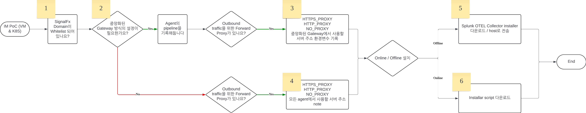

# splunk-otel-usecase (IM)
Providing dynamic usecases for opentelemetry collector IM
## Cloud Provider계정과의 통합
#### AWS 
#### Azure

## Opentelemetry Collector Installation


### Prerequisites 
[1. Collector requirements 체크](https://docs.splunk.com/observability/en/gdi/opentelemetry/otel-requirements.html#collector-requirements
) 
 
#### Linux
Splunk Observability Collector 지원 OS/version

- Amazon Linux: 2, 2023. Log collection with Fluentd is not currently supported for Amazon Linux 2023.

- CentOS, Red Hat, or Oracle: 7, 8, 9

- Debian: 9, 10, 11

- SUSE: 12, 15 for version 0.34.0 or higher. Log collection with Fluentd is not currently supported.

- Ubuntu: 16.04, 18.04, 20.04, and 22.04

- Rocky Linux: 8, 9

#### Windows 
##### Installer script
- Windows 10 Pro and Home, Windows Server 2016, 2019, 2022

<br>

[2. Splunk Domain 네트워크 허용](https://docs.splunk.com/observability/en/admin/authentication/allow-services.html#allow-splunk-observability-cloud-services-in-your-network)

#### HTTP/HTTPS Proxy를 이용하는 경우 (Agent Mode)
Proxy를 사용하여 Internet에 접속할 수 있다면, HTTP / HTTPS Proxy를 사용하는 것이 가장 간단한 방법입니다. 
Network 에서 허용할 URL목록, 또는 Network 에서 허용할 목록에 나열된 [URL](https://docs.splunk.com/observability/en/admin/authentication/allow-services.html#urls-to-allow-in-your-network)로 아래 URL을 대상으로 HTTP / HTTPS network 연결을 하도록 설정하세요.

##### Allow URL
```
\*.signalfx.com
\*.<YOUR_REALM>.signalfx.com
```
|Rule|Port|Destination|
|---|---|---|
|Outbound|443|```/*.signalfx.com```|
|Outbound|443|```/*<REALM>.signalfx.com```|
|Inbound / Outbound |80|```packages.treasuredata.com```|
|Inbound / Outbound |80|```splunk.jfrog.io```|
|Inbound / Outbound |80|```jfrog-prod-use1-shared-virginia-main.s3.amazonaws.com```|


도메인 베이스로 허용하고 싶은 경우 아래의 Domain을 allow list에 추가해주세요.
```
# Observability Cloud API 용 URL (https://dev.splunk.com/observability/docs/apibasics/api_list)
api.<YOUR_REALM>.signalfx.com

# Splunk Observability Cloud user interface
app.<YOUR_REALM>.signalfx.com
customer-api.<YOUR_REALM>.signalfx.com

# CSplunk Observability Cloud files 과 installers 목적의 CDN
# 주의: 파일들은 on Github.com 에 hosting됩니다. 
dl.signalfx.com

# Backfill API base URL (https://dev.splunk.com/observability/reference/api/backfill/latest)
backfill.<YOUR_REALM>.signalfx.com

# Data ingest API base URL (https://dev.splunk.com/observability/docs/datamodel/ingest/)
ingest.<YOUR_REALM>.signalfx.com

# SignalFlow API base URL (https://dev.splunk.com/observability/reference/api/signalflow/latest)
stream.<YOUR_REALM>.signalfx.com

# RUM ingest endpoint
rum-ingest.<YOUR_REALM>.signalfx.com/v1/rum

# Linux와 Windows의 td-agent와 Fluentd 패키지 용
packages.treasuredata.com

# DEB/RPM collector 패키지 다운로드 용 URL
splunk.jfrog.io
jfrog-prod-use1-shared-virginia-main.s3.amazonaws.com
```

#### Gateway Mode를 이용하는 경우 (Gateway Mode)
Open telemetry collector를 Gateway mode로 구성하는 경우 collector를 이용해 Metric을 로컬에서 전송, Gateway에서 telemetry로 전달하는 방식으로 활용할 수 있습니다. 

Gateway collector에는 [URL whitelisting](./README.md/#allow-url) 이나 domain을 허용해주세요.

collector에서 정보를 수신할 수 있도록 하는 endpoint와 port 정보는 아래와 같습니다. 

|Endpoint|Description|
|---|---|
|http(s)://0.0.0.0:13133/ |Collector 상태체크를 위한 extension|
|http(s)://0.0.0.0:[6831|6832|14250|14268]/api/traces|gRPC 프로토콜 사용을 위한 Jaeger receiver|
|http(s)://localhost:55679/debug/[tracez|pipelinez]|컴포넌트 상태체크를 위한 zPages extension|
|http(s)://0.0.0.0:[4317|4318]|gRPC와 http를 이용하는 OTLP receiver 용|
|http(s)://0.0.0.0:6060|apiUrl데이터 수집 용 smart agent HTTP 포워더|
|http(s)://0.0.0.0:7276|SAPM trace receiver| 
| http://localhost:8888/metrics | 내부 프로메테우스 메트릭 용|
|http(s)://localhost:8006|Fluent forward receiver|
|http(s)://0.0.0.0:9411/api/[v1|v2]/spans|Zipkin receiver|
|http(s)://0.0.0.0:9943|Metric / Log / Trace를 수신하는 SignalFx receiver|


#### 3. Installation script 접근 권한 허용

- Linux installation script는 ```sudo``` 권한이 필요합니다. 
- Windows installation script는 ```administrator``` 권한이 필요하며, Powershell은 ```3.0``` 이상의 version이어야합니다. 

#### [4. (optional) Log Observer connect와 연동하는 경우 - prerequisites](https://docs.splunk.com/observability/en/logs/set-up-logconnect.html#prerequisites)


### 설치 가이드
#### On Prem - Linux Agent Mode

```
curl -sSL https://dl.signalfx.com/splunk-otel-collector.sh > /tmp/splunk-otel-collector.sh && \
sudo sh /tmp/splunk-otel-collector.sh --realm <YOUR_REALM> -- <YOUR_ACCESS_TOKEN> --mode agent --with-instrumentation --deployment-environment <YOUR_ENVIRONMENT> --discovery
```

- ```/etc/otel/collector/agent_config.yaml``` : Otel collector 기본 설정 파일

- ```/etc/otel/collector/splunk-otel-collector.conf``` : Otel collector service에 필요한 변수 / 값이 포함된 환경 변수 conf 파일

2개의 파일이 생성됩니다.

```
sudo systemctl restart splunk-otel-collector
```
파일이 수정된 경우 splunk otel collector를 Restart합니다. 


