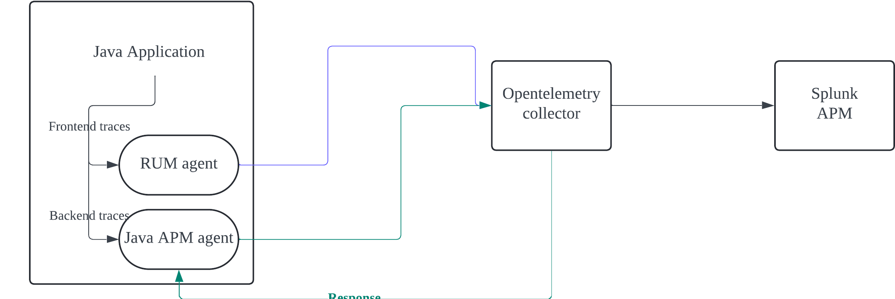

# splunk-otel-usecase (APM)
Providing dynamic usecases for opentelemetry collector 


## Java Agent
다양한 instrumentation 요구사항에 맞게 Splunk Distribution of Open Telemetry Java를 사용하여 Java agent를 구성할 수 있습니다.
Splunk otel Java와 JVM agent를 사용해 구성할 수 있는 옵션입니다. 


### HTTP Server-timing header 비활성화
------
Opentelemetry collector 설정에서 모바일 / 웹 애플리케이션의 실시간 사용자 모니터링을 하는 RUM(Frontend) Application의 서버에서 Transaction을 추적하고 성능 데이터를 수집하는 APM을 통합할 수 있습니다.  <br>

이를 위해서, opentelemetry collector가 Java instrumentation agent에게 응답할 때 Response headers에 아래와 같은 trace response headers를 자동으로 추가합니다.
```
Access-Control-Expose-Headers: Server-Timing
Server-Timing: traceparent;desc="00-<serverTraceId>-<serverSpanId>-01"
```



```Server-Timing``` Header에는 traceId와 spanId parameter가 ```traceparent``` 형식으로 포함됩니다. <br>

예시:
```traceparent;desc="00-35167132c6e965daca6c09c77c5b4cad-f6e248cd8a536ee1-01"```

#### Server-timing header enable / disable 구성 방법 
spec.containers.command에 아래 cmd를 삽입 
```-Dsplunk.trace-response-header.enabled=false```

[구성방법](./java-disabling-server-trace/disabling-server-trace.yaml) <br>

